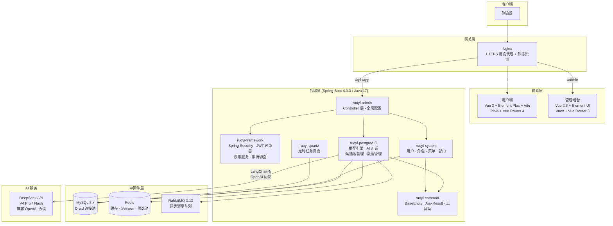
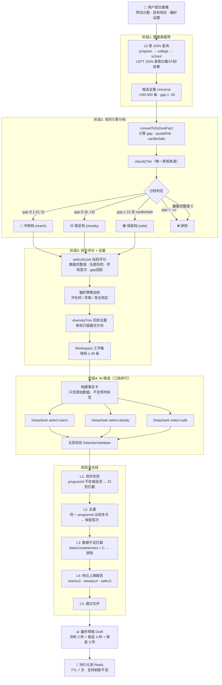
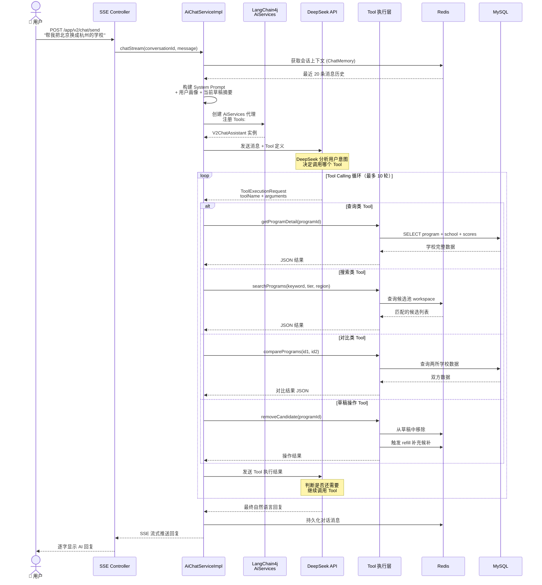

# 408 考研择校决策平台（Postgrad Selector）

<p align="center">
  <strong>数据驱动 · 规则推荐 · 来源可追溯 · AI 辅助决策</strong>
</p>

<p align="center">
  <a href="https://408lab.site" target="_blank">🌐 在线体验</a> &nbsp;|&nbsp;
  <a href="./docs/考研择校决策平台立项说明书-增强版.md">📋 立项说明书</a> &nbsp;|&nbsp;
  <a href="./docs/项目技术文档-完整版.md">📖 技术文档</a>
</p>

---

## 平台简介

**408 考研择校决策平台**是一个面向全专业、全国性考研择校的数据驱动型推荐系统。第一阶段以 408 计算机相关方向为样板，通过 **"数据库筛选 → 规则引擎 → AI 分析 → 多重校验"** 四阶段流水线，为用户自动生成包含**冲刺、稳妥、保底**三档的择校方案。

> 本项目不是普通资料查询站，也不是纯 AI 聊天推荐工具。每一条推荐都有明确的数据来源和可追溯的证据链。

### 核心数据规模

| 指标 | 数值 |
|------|------|
| 高校数量 | 486 所 |
| 408 专业项目 | 2,023 个 |
| 录取记录 | 24,000+ 条 |
| 数据年份覆盖 | 2023-2025 年 |
| 考试科目组合 | 2 套（22408 / 11408） |

### 在线地址

- **用户端**: [https://408lab.site](https://408lab.site)
- **管理后台**: `https://408lab.site/admin`
- 演示账号：`admin` / `admin123`

---

## 系统架构图



---

## 推荐引擎流程图（Agent 核心链路）



---

## AI 对话 Tool Calling 流程图



### Tool 清单

| Tool | 类别 | 功能 |
|------|------|------|
| `getProgramDetail` | 查询 | 查询指定专业的完整数据（学校层次、录取均分、招生人数、复试线） |
| `searchPrograms` | 搜索 | 在候选池中按关键词/档位/地区搜索 |
| `comparePrograms` | 对比 | 并排对比两所学校的核心指标 |
| `getDraftContext` | 查询 | 查看当前草稿状态——已选学校、档位分布 |
| `removeCandidate` | 写操作 | 从草稿中移除指定候选，触发候补补充 |
| `replaceCandidate` | 写操作 | 替换草稿中的候选，触发候补补充 |
| `addBackCandidate` | 写操作 | 将候补池中的学校加回草稿 |
| `getAlternatives` | 查询 | 获取某档位的候补选项列表 |

---

## 技术栈

| 层次 | 技术 | 版本 |
|------|------|------|
| **后端框架** | Spring Boot（jakarta namespace） | 4.0.3 |
| **语言** | Java | 17 |
| **ORM** | MyBatis + MyBatis XML Mapper | 4.0.1 |
| **数据库** | MySQL（Druid 连接池） | 8.x |
| **缓存** | Redis（Lettuce 客户端） | — |
| **AI 框架** | LangChain4j（兼容 OpenAI 协议） | 1.15.0 |
| **AI 模型** | DeepSeek（V4 Pro / Flash） | — |
| **安全框架** | Spring Security + JWT | — |
| **消息队列** | RabbitMQ | 3.13 |
| **前端（管理端）** | Vue 2.6 + Element UI 2.15 + Vuex + Vue Router | — |
| **前端（用户端）** | Vue 3 + Element Plus + Vite + Pinia | — |
| **构建工具** | Maven 多模块 / Vue CLI 4 / Vite | — |

---

## 项目结构

```
pom.xml (root, packaging=pom)
├── ruoyi-admin          — 入口模块（RuoYiApplication）、Controller 层、全局配置
├── ruoyi-framework      — 安全框架（JWT 过滤器、权限服务、限流切面）、线程池配置
├── ruoyi-postgrad       — 🎯 核心业务模块：推荐引擎、AI 对话、候选池管理
├── ruoyi-system         — 系统管理域（用户、角色、菜单、部门、公告）
├── ruoyi-common         — 共享层：BaseEntity、AjaxResult、注解、工具类
├── ruoyi-generator      — 代码生成器（Velocity 模板 → 完整 CRUD 栈）
├── ruoyi-quartz         — 定时任务管理（内存调度器）
├── ruoyi-ui/            — 管理后台前端（Vue 2 + Element UI）
├── user-ui/             — 用户端前端（Vue 3 + Element Plus）
└── sql/                 — 数据库初始化 SQL
```

---

## 核心功能

### 用户端

- **📝 用户画像**：填写预估分数、目标地区、本科层次、跨考情况、风险偏好、学校层次偏好
- **🤖 AI 智能推荐**：四阶段流水线自动生成冲刺/稳妥/保底三档择校方案（共 10 所）
- **💬 AI 对话调整**：通过自然语言对话对推荐结果进行增删替换，8 个 Tool 支持查询/搜索/对比/写操作
- **📊 推荐报告**：生成包含执行摘要、画像基础、档位分析、数据透明度的完整择校报告
- **⭐ 收藏管理**：收藏感兴趣的专业方向，支持批量操作
- **📈 历史记录**：查看历史推荐记录和 AI 对话历史

### 管理后台

- **📋 学校/专业/学院管理**：486 所高校、2,023 个 408 专业方向的 CRUD 维护
- **📊 录取数据管理**：复试线、录取最低分/平均分、招生计划、录取结果
- **🔍 数据质量管控**：每条数据完整度评级（A/B/C）+ 数据来源追溯
- **📝 审核系统**：对入库数据进行审核确认
- **👤 系统管理**：用户、角色、菜单、权限、字典、参数、日志、在线用户监控
- **🔧 代码生成器**：Velocity 模板一键生成前后端 CRUD 代码

---

## 快速开始

### 环境要求

| 软件 | 版本要求 | 说明 |
|------|---------|------|
| JDK | 17+ | 后端编译与运行 |
| Maven | 3.6+ | 后端构建 |
| MySQL | 8.0+ | 数据持久化 |
| Redis | 6.0+ | 缓存、Session、候选池 |
| Node.js | 16+ | 前端开发（两个前端都需要） |
| RabbitMQ | 3.13+ | 消息队列（可选，本地开发可跳过） |

### 1. 初始化数据库

```bash
# 创建数据库
mysql -u root -p -e "CREATE DATABASE IF NOT EXISTS postgrad_selector DEFAULT CHARACTER SET utf8mb4;"

# 按顺序导入 SQL（必须按此顺序）
mysql -u root -p postgrad_selector < sql/ry_20260417.sql
mysql -u root -p postgrad_selector < sql/quartz.sql
mysql -u root -p postgrad_selector < sql/408_school_selection_schema.sql
mysql -u root -p postgrad_selector < sql/postgrad_school_menu.sql
mysql -u root -p postgrad_selector < sql/postgrad_crud_menu.sql
```

### 2. 配置环境变量

```bash
# 必需（Windows 使用 set 命令）
export MYSQL_USERNAME=root
export MYSQL_PASSWORD=your_password
export JWT_SECRET=your_jwt_secret_string
export REDIS_PASSWORD=your_redis_password    # Redis 无密码则不设

# AI 推荐功能必需（不使用 AI 功能可不设）
export DEEPSEEK_API_KEY=sk-your-deepseek-api-key
```

### 3. 启动后端

```bash
# 编译（跳过测试加速）
mvn clean package -Dmaven.test.skip=true

# 运行
java -jar ruoyi-admin/target/ruoyi-admin.jar
```

后端启动后访问 `http://localhost:8080`，Swagger 文档在 `http://localhost:8080/swagger-ui/index.html`。

### 4. 启动前端

**管理后台（开发模式）：**

```bash
cd ruoyi-ui
npm install
npm run dev
# → http://localhost:8081
# 自动代理 /dev-api → localhost:8080
```

**用户端（开发模式）：**

```bash
cd user-ui
npm install
npm run dev
# → Vite 开发服务器（默认端口由 Vite 分配）
```

### 5. 登录验证

打开 `http://localhost:8081`，使用 `admin / admin123` 登录管理后台，确认功能正常。

---

## 部署说明

### 本地 / 个人电脑部署

适用于在本机运行完整服务，供自己或局域网内同学使用。

**方案一：直接运行（开发/演示）**

```bash
# 终端 1: 确保 MySQL 和 Redis 已启动，然后
java -jar ruoyi-admin/target/ruoyi-admin.jar

# 终端 2: 管理后台
cd ruoyi-ui && npm run dev

# 终端 3: 用户端
cd user-ui && npm run dev
```

**方案二：生产构建 + Nginx（推荐给同学演示）**

```bash
# 1. 构建前端静态文件
cd ruoyi-ui && npm run build:prod    # 输出到 ruoyi-ui/dist/
cd user-ui && npm run build          # 输出到 user-ui/dist/

# 2. 配置 Nginx
# 将以下配置放入 nginx.conf 的 server 块中（见下方 Nginx 配置）

# 3. 启动后端
java -jar ruoyi-admin/target/ruoyi-admin.jar

# 4. 启动/重载 Nginx
nginx -s reload
```

访问 `http://localhost` 即可使用完整系统。

**Nginx 参考配置：**

```nginx
server {
    listen 80;
    server_name localhost;

    # 用户端
    location / {
        root /path/to/user-ui/dist;
        index index.html;
        try_files $uri $uri/ /index.html;
    }

    # 管理后台
    location /admin {
        alias /path/to/ruoyi-ui/dist;
        index index.html;
        try_files $uri $uri/ /admin/index.html;
    }

    # 后端 API
    location /api/ {
        proxy_pass http://localhost:8080/;
        proxy_set_header Host $host;
        proxy_set_header X-Real-IP $remote_addr;
    }

    # App 端 API
    location /app/ {
        proxy_pass http://localhost:8080/app/;
        proxy_set_header Host $host;
    }
}
```

> **Windows 用户**：可以使用 [nginx-for-windows](http://nginx.org/en/docs/windows.html) 或上面的"直接运行"方式，无需 Nginx。

### 云服务器部署

项目已部署于腾讯云轻量应用服务器，架构同上。配置文件位于服务器 `/www/server/panel/vhost/nginx/` 目录下。

- **云服务**: 腾讯云轻量应用服务器
- **面板**: 宝塔 Linux 面板
- **域名**: [408lab.site](https://408lab.site)

---

## 项目截图

> 📸 截图待补充。运行项目后可通过浏览器截图以下页面：
>
> - 用户端：画像填写页 → 推荐结果页 → AI 对话页 → 择校报告页
> - 管理后台：学校列表 → 专业管理 → 数据质量面板 → 审核系统

---

## 文档索引

| 文档 | 说明 |
|------|------|
| [立项说明书（增强版）](./docs/考研择校决策平台立项说明书-增强版.md) | 项目背景、定位、目标用户、商业验证 |
| [需求说明书（MVP）](./docs/考研择校平台需求说明书-MVP.md) | MVP 阶段功能范围与验收标准 |
| [数据库设计文档](./docs/考研择校平台数据库设计文档-MVP.md) | 数据表结构与关系设计 |
| [项目技术文档（完整版）](./docs/项目技术文档-完整版.md) | 系统架构、业务流程、部署运维 |
| [AI 推荐链路完整文档](./docs/AI推荐链路完整文档.md) | 四阶段推荐引擎的完整数据变换链路 |

---

## 开发约定

本项目基于若依（RuoYi v3.9.2）框架定制开发，遵循三层架构规范：

```
Controller → IService/ServiceImpl → Mapper → Mapper XML
```

- **Controller**（`ruoyi-admin`）：仅接收请求、校验参数、返回响应，**严禁业务逻辑**
- **Service**（`ruoyi-postgrad`）：所有业务逻辑、计算、校验、编排
- **Mapper**（`ruoyi-postgrad`）：数据访问 + MyBatis XML 中的所有 SQL
- 禁止使用 JdbcTemplate / NamedParameterJdbcTemplate，所有数据库访问必须通过 Mapper + MyBatis XML
- 新功能必须使用标准三层架构，不得扩展旧的泛型 CRUD 模式

详细规范见 [CLAUDE.md](./CLAUDE.md)。

---

## 致谢

- 基础框架基于 [若依 RuoYi-Vue](https://gitee.com/y_project/RuoYi-Vue)（Spring Boot 4.x 分支）
- AI 能力由 [DeepSeek](https://deepseek.com) 提供

---

## License

本项目基于 RuoYi-Vue 修改，遵循 MIT License。
